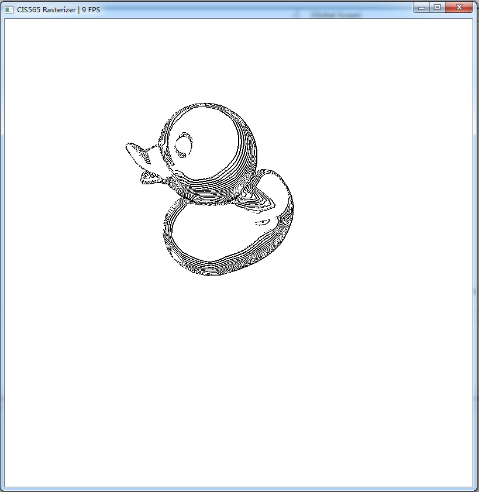
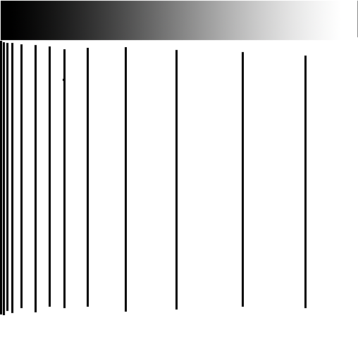

CUDA Rasterizer
===============

[CLICK ME FOR INSTRUCTION OF THIS PROJECT](./INSTRUCTION.md)

**University of Pennsylvania, CIS 565: GPU Programming and Architecture, Project 4**

* JuYang
* ### Tested on: Windows 7, i7-4710MQ @ 2.50GHz 8GB, GTX 870M 6870MB (Hasee Notebook K770E-i7)

## HighLight Features

## 1. Toon Shader

    
I made a toon shader with outline drawing.

In my toon shader function, I requested one more parameter: float layers. 

This parameter is used to define how many segments the toon shader will have. 

When passing to the toon shader, the color space is continuous from 0 to 1, then it will be divided into several segments. 

For example, if we have 5 segments, then colors from 0 to 0.2 falls to the first segment, and colors from 0.2 to 0.4 falls to the second segment. 

This step is simple, next is to draw the lines. 

If you look at "borderland", which is a successful toon shader game, you will find out that there're 2 kinds of lines: 

the lines that surrounds the object, called "outer line". 

and the lines that appears within the object(usually used to illustrate important geomitry, like nose and eyes and lips). I call them "inner line"

The technique to draw outer lines is simple. Insdead of checking dot(pixel.normal,camera.foward) changes from positive to negative, we can simply check the depth buffer. If the depth differs a lot, larger than the threshold, we can assume that this is a boundary. 

And about inner lines. Since inner lines present the sharp edge of geomitry, or the boundaries between 2 objects(eg. eyeballs and eyelids)， we should check the normal differents. If the normal differs a lot at a point, larger than the normal's threshold, we can say that this is a inner line boundary.

This picture presents the debugging mode for outlines drawing. The red line is the outer line, and the green line is the inner line. You can see that inner lines appears as assisting lines that helps to draw the geomtries. 

    
## 2. Sketch Shader

In fact, this shader is inspired by one of the many bugs I have. 

Then, it reminds me of a kind of comic books that's once popular in China during the 1960s

When I was a child, I have a lot of these comic books that my father read when he was a child. Well, now I know this is called pen drawing, a complicated art. 

Then I tried to mock this art form, and this is my first trial, a naive sketch. 

In this implimentation, I only drawed the color gradiant outline from toon shader. But when looking at this, I think something is wrong. 
Since I have no idea about drawing, I asked a friend who's an art student. 

The law of pen drawing is: 

1- always draw lines in same width. 

2- using line density to present surface color intensity. (The darker an area is, the more lines it will have)

3- lines should follow the surface's geomtry. 

I think this could illustrate that well. 

So here's the problem: 
we need the line density to be non-linear, 
and even in the darkest areas, we CAN NOT paint them all black. Instead, we need them to be one after another, the darker, the closer. 

Good thing is, we can re-use the toon shader codes, with some modifications. 

In toon shader, color discret is done by: 

int r = (color.x) * layers;

But we do: 

int r = (color.x * color.x) * layers;

r % = 2;

So half the color segments are turned to be totally white, and half are totally black. 

And it's black after white after black after white... in sequence. 

Then what we need to do is to draw the gradiant outlines. 

I slightly modified the function I used before as naive sketching, now we only detect color increasing, rather than depth changing. 

#### Minor improvements on sketch shader

After that, I googled some tutorials about pen drawing, and there're 2 more rules(that I can understand) : 

1- Lines shouldn't always appear as loops, they should break at highlight areas. 

2- For rather white areas, don't draw any lines, leave them blank. 

For the first law, we could change the code in toon shader a little bit by: 

int r = color.x * layers;

r % = 2;

out.color = glm::vec3(r * color.x, g * color.y, b * color.z);

We are, in fact, still using color.x * color.x, but this time, the output lines varies in Intensity. 

And in sketch shader, we add a threshold. If the difference in color is smaller than the threshold, we don't think this is a gradient outline. 

As for the second law, we can do this by adding a threshold in the toon shader, if Intensity is larger than the threshold, we output white color in this pixel, and it will be ignored in the sketch shader. 

## Bugs and errors

1. Since I did no optimization, the FPS will drop quickly when moving the camera near. And when it is near enough, the program collapse. Sometimes the graphic driver will stop. 

2. The texture UV is still not right, I'm pretty sure it is not due to pixel correction since there's no way the textures of eyes could appear on the duck's wings! Still no idea why. 

## Functions implemented

### raster_naive3

This function does simple naive raster, per triangle. 

Output color with lambert law, assume the light is on camera. 

Since the texture is not working, assume the object is mono-color in texture. 

Its brother, raster_naive2, can paint texture, but in wrong UV.

raster_naive3 << <numPrims, numThreadsPerBlock >> > 

(totalNumPrimitives, dev_primitives, dev_depth, dev_fragmentBuffer, width, height, color);

### toon shader

This function works on the color and depth offered by raster_naive3

Does basic color disctreting, and draw outer lines and inner lines.

If you wish to see the red and green lines for debugging, uncomment some codes marked inside the function.

Notice, if you wish to have 10 segments in color space, input layers as 20. 

toon_shader << <blockCount2d, blockSize2d >> >

(width, height, dev_fragmentBuffer, dev_framebuffer, dev_depth, layers);

### sketch_shader

This function works after toon shader (but not required to generate a toon render)

It does basic sketching based on color gradiants. 

threshold defines how sensitive the shader is to color differs. Smaller threshold means more sinsitive. 

sketch_shader << <blockCount2d, blockSize2d >> >(width, height, dev_fragmentBuffer, dev_framebuffer, dev_depth, threshold);

### toon_shader2 and sketch_shader2

They are slightly modified version of toon_shader and sketch_shader, combining these 2 functions together, we can get the sketch rendered as is shown above. 

toon_shader2 << <blockCount2d, blockSize2d >> >

(width, height, dev_fragmentBuffer, dev_framebuffer, dev_depth, layers, threshold);

threshold controls how large the white area is. The bigger this float, the larger the blank area. 

sketch_shader2 << <blockCount2d, blockSize2d >> >

(width, height, dev_fragmentBuffer, dev_framebuffer, dev_depth, threshold_g);

threshold_g controls how likely a line will break. The bigger the threshold_g, the less likely a line will break in brighter area. 
